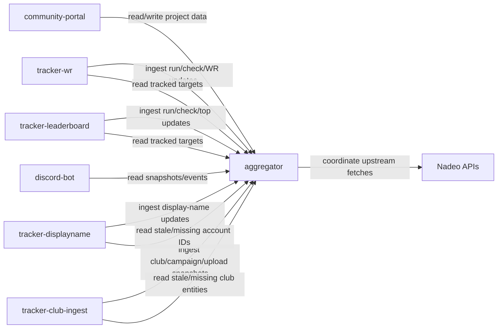

# Service Architecture

This document describes the service boundaries for a multi-community Trackmania stack.

## Goals

- Keep each service focused on one job.
- Avoid duplicated Nadeo requests across instances.
- Support multiple project instances that reuse shared cache data.
- Keep per-community branding and policy in the portal layer.

## Service Map

During migration, folder names stay as-is while logical names are documented here.

| Logical Name | Current Path | Role |
| --- | --- | --- |
| `community-portal` | `services/altered` | User-facing site and admin flows for one community/project. |
| `tracker-wr` | `services/tracker` | Polls top records (WR-focused) and emits WR change updates. |
| `tracker-leaderboard` | `services/tracker` | Polls top-N leaderboard snapshots for tracked maps. |
| `tracker-displayname` | `services/tracker-displayname` | Resolves account IDs to display names and writes updates to aggregator. |
| `tracker-club-ingest` | `services/tracker-club` | Ingest runtime for project-owned club structure crawlers. |
| `aggregator` | `services/aggregator` | Shared cache/API layer and federation point. |
| `discord-bot` | (new service) | Reads aggregator events/snapshots and posts to Discord. |

## Core Rule

`aggregator` owns shared operational data:

- map metadata
- leaderboard snapshots and latest WR state
- account ID and display-name history
- club/campaign/upload structure snapshots

Other services should read from aggregator first and write normalized updates back.

## Ownership Boundaries

### community-portal (`altered`)

- Owns community-specific UX, admin state, and business logic.
- Owns branding assets and theme behavior for the community.
- Reads shared entities from aggregator.
- Can trigger tracker jobs, but does not own tracker runtimes.

### tracker-wr (`tracker`)

- Owns WR-focused polling and scheduling for tracked maps.
- Emits WR change events and run telemetry to aggregator.
- Can forward WR webhooks to project services.

### tracker-leaderboard (`tracker`)

- Owns top-N leaderboard polling and scheduling for tracked maps.
- Emits scan/check/top-change updates to aggregator.
- Does not own community business entities (clubs/campaign governance).

### tracker-displayname

- Owns display-name refresh cadence and sync logic.
- Resolves account IDs in batches and writes normalized updates to aggregator.
- Reads from aggregator first to reduce duplicate upstream calls.

### tracker-club-ingest

- Provides ingest APIs/runtime for project-owned club/campaign/upload snapshots.
- Writes normalized club structure snapshots to aggregator.
- Project services (for example `community-portal`) own crawl cadence.

### aggregator

- Owns shared cache freshness policy.
- Owns dedupe, idempotency, and cross-project read models.
- Coordinates upstream request policy (leases/cooldowns) to reduce duplicates.

### discord-bot

- Reads from aggregator only.
- Does not call Nadeo directly.
- Publishes notifications from aggregator snapshots/events.

## Instance and Tenancy

Each deployment unit is identified by:

- `tenant_id`: operator/community namespace (example: `altered`, `yeet`)
- `project_key`: project instance key (example: `altered-prod`, `yeet-prod-eu`)
- `instance_id`: runtime process identity

Shared entities can be reused across tenants when safe:

- `map_uid`
- `account_id`

Tenant-local entities stay local:

- admin users/sessions
- portal preferences/theme
- private webhook credentials

## Data Access Policy

Use aggregator-first read-through:

1. Service requests entity data from aggregator with a freshness target (`max_age_seconds`).
2. Aggregator returns `fresh`, `stale`, or `missing`.
3. Service fetches only stale/missing data from upstream when allowed.
4. Service upserts normalized results back to aggregator.

This enables cache reuse across projects and reduces duplicate requests.

## Request Coordination

To avoid duplicate upstream calls:

- Use idempotent ingest keys (`source_event_id`, `observed_at`, `project_key`).
- Use fetch leases per cache key (`entity_type + id`) for expensive endpoints.
- Enforce minimum request gaps centrally for upstream APIs.

## API Shape

Transport can start as REST + SSE.

- Ingest endpoints: normalized writes from trackers/portal.
- Query endpoints: read models for portal/bot/analytics.
- Stream endpoint: live change feed for dashboards and bots.

Suggested cache keys:

- `display_name:{account_id}`
- `map:{map_uid}`
- `leaderboard:{map_uid}:{scope}`
- `club:{club_id}:structure`

## Portal Branding Requirements

Community portal should support data-driven branding overrides:

- theme token file (colors, typography, spacing)
- logo/background asset override path
- custom title/metadata strings
- optional custom CSS loaded after base styles

Do not fork core logic per community.

## Naming and Compatibility

Current folder names remain:

- `services/altered` remains runtime path for `community-portal`.
- `services/tracker` remains runtime path for `tracker-wr` and `tracker-leaderboard`.
- New trackers use dedicated folders (`services/tracker-displayname`, `services/tracker-club`).

Migration order:

1. Update docs/UI labels.
2. Optionally rename directories later.

## Reference Flow

