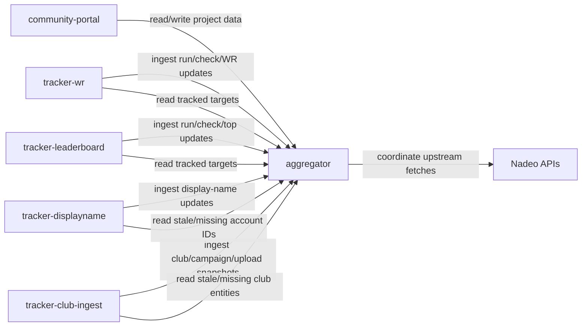

# Service Architecture

This document describes the service boundaries for a multi-community Trackmania stack.

## Goals

- Keep each service focused on one job.
- Avoid duplicated Nadeo requests across instances.
- Support multiple project instances that reuse shared cache data.
- Keep per-community branding and policy in the portal layer.

## Domain Map

During migration, folder names stay as-is while logical names are documented here. The complete process, port,
health-check, and source-path inventory is generated in `PLATFORM_CATALOG.md` from
`config/platform-manifest.json`; this table describes domain ownership and deliberately does not duplicate that
operational catalog.

| Logical Name          | Current Path                       | Role                                                                                                                    |
| --------------------- | ---------------------------------- | ----------------------------------------------------------------------------------------------------------------------- |
| `community-portal`    | `services/altered`                 | User-facing site and admin flows for one community/project.                                                             |
| `xjk-auth`            | `services/xjk-auth`                | Shared account, session, and platform authentication runtime.                                                           |
| `learn-profile`       | `services/learn-profile`           | Authenticated Learn profile and progress API.                                                                           |
| `console-hub`         | `services/console-hub`             | Console rooms and game-mode coordination API.                                                                           |
| `bannerbuilder`       | `services/bannerbuilder`           | Altered banner rendering and persistence API.                                                                           |
| `tracker-wr`          | `services/tracker`                 | Polls top records (WR-focused) and emits WR change updates.                                                             |
| `tracker-leaderboard` | `services/tracker`                 | Polls top-N leaderboard snapshots for tracked maps.                                                                     |
| `tracker-displayname` | `services/tracker-displayname`     | Resolves account IDs to display names and writes updates to aggregator.                                                 |
| `tracker-club-ingest` | `services/tracker-club`            | Ingest runtime for project-owned club structure crawlers.                                                               |
| `aggregator`          | `services/aggregator`              | Shared cache/API layer and federation point.                                                                            |
| `validifier-public`   | `services/validifier-public`       | Canonical public Validifier website and public API backed by the private validation service.                            |
| `cotd-public`         | `services/cotd-public`             | Public COTD/TOTD style snapshot website/API backed by stored ingest/fetch payloads and a generalized classifier client. |
| `plugins-hub`         | `sites/plugins.xjk.yt/Plugins-Hub` | Plugin catalog aggregation and the public plugin-discovery UI.                                                          |
| `tools-hub`           | `sites/tools.xjk.yt/Tools-Hub`     | Manifest-backed catalog and launcher for the Trackmania file tools.                                                     |
| `tool-runtimes`       | `sites/tools.xjk.yt/*/backend`     | Isolated upload, validation, transformation, and download processes for individual file tools.                          |

## Core Rule

`aggregator` owns shared operational data:

- map metadata
- leaderboard snapshots and latest WR state
- account ID and display-name history
- club/campaign/upload structure snapshots

Other services should read from aggregator first and write normalized updates back.

## Module Boundaries

- Runtime entrypoints create dependencies, register routes, and start the process. They do not contain domain logic.
- Compatibility facades preserve stable public APIs while delegating to focused domain modules.
- Repository facades coordinate persistence modules; SQL and row mapping stay with the repository that owns the data.
- Browser entry modules bootstrap one feature and delegate state, transport, rendering, and lifecycle behavior.
- Cross-service primitives belong in `services/shared`; cross-site browser primitives belong in
  `sites/shared/xjk-core`.
- Browser code that intentionally renders markup uses `XjkSafeHtml.set`; raw HTML parser sinks are confined to that
  sanitizer and rejected elsewhere by lint and repository checks.
- Server-side fetches of URLs derived from upstream payloads use `services/shared/httpEgressPolicy.js`; public DNS,
  destination allowlists, and every redirect are validated before the next request is sent.
- Domain adapters may wrap a shared primitive when they add real policy such as throttling, authentication, fallback
  routing, or response metadata.

Executable modules have an 850-line ceiling enforced by `test/source-architecture.test.mjs`. Server entrypoints,
service and split-module facades, and module barrels are limited to 300 lines; browser `app.js` entrypoints are limited
to 700. A larger file must be split by responsibility. Exemptions are reserved for declarative catalogs, fixtures, and
geometry datasets, with a specific rationale for every exempt file.

Authored stylesheets have a 700-line ceiling enforced by `test/css-module-architecture.test.mjs`. JavaScript functions
are capped at 350 lines and a cyclomatic complexity of 80 by ESLint. These limits apply to browser and service code
alike, so splitting a facade cannot move the same orchestration into one oversized function or stylesheet. Ratchet
the limits toward 250 lines and complexity 60 as the remaining legacy workflows are decomposed.

PowerShell functions have a 120-line ceiling enforced alongside syntax parsing by
`scripts/check-powershell-syntax.ps1`. Long operational workflows are composed from focused functions; generated
script bodies belong in standalone templates instead of being hidden in orchestration functions.

Bannerbuilder Python functions use the same 120-line ceiling in `scripts/check-bannerbuilder.py`, which also compiles
the service and runs its behavior suite.

## Verification

Behavior tests live in the owning service's `test` directory, site-local `test` directories, or the repository-level
`test` directory for shared contracts. `npm run check` is the canonical local and CI entrypoint; structural checks are
kept as deployment and catalog invariants rather than used as a substitute for unit and route-contract tests. The
same entrypoint also parses every JavaScript and PowerShell source, lints all first-party JavaScript, and enforces
repository-safety and duplication budgets, so new modules cannot silently reintroduce missing exports, local paths,
credentials, or copy-and-modify implementations.

## Ownership Boundaries

### community-portal (`altered`)

- Owns community-specific UX, admin state, and business logic.
- Owns branding assets and theme behavior for the community.
- Reads shared entities from aggregator.
- Can trigger tracker jobs, but does not own tracker runtimes.

### tracker-wr (`tracker`)

- Owns WR-focused polling and scheduling for tracked maps.
- Emits WR change events and run telemetry to aggregator.
- Can forward WR webhooks to project services.

### tracker-leaderboard (`tracker`)

- Owns top-N leaderboard polling and scheduling for tracked maps.
- Emits scan/check/top-change updates to aggregator.
- Does not own community business entities (clubs/campaign governance).

### tracker-displayname

- Owns display-name refresh cadence and sync logic.
- Resolves account IDs in batches and writes normalized updates to aggregator.
- Reads from aggregator first to reduce duplicate upstream calls.

### tracker-club-ingest

- Provides ingest APIs/runtime for project-owned club/campaign/upload snapshots.
- Writes normalized club structure snapshots to aggregator.
- Project services (for example `community-portal`) own crawl cadence.

### aggregator

- Owns shared cache freshness policy.
- Owns dedupe, idempotency, and cross-project read models.
- Coordinates upstream request policy (leases/cooldowns) to reduce duplicates.

### validifier-public

- Owns the public Validifier web UX and stable public API contract.
- Reads from the private validation backend using server-only credentials.
- Normalizes, redacts, reshapes, and optionally caches verification data for public clients.
- Does not expose private/admin behavior from the internal validation system.

### cotd-public

- Owns the public Cup of the Day / Track of the Day style snapshot UX and stable API contract for Openplanet and web clients.
- Stores latest plus archived TOTD days, Nadeo map info, downloaded GBX files, and classification payloads in SQLite.
- Can poll official Nadeo TOTD month/map-info endpoints when configured, then stores maps as `pending_classifier` until generalized classifier output is available.
- Calls the generalized Trackmania Map Classifier through configurable HTTP adapter settings only.
- Does not train models, scrape leaderboards, or add COTD-specific behavior to the classifier service.

### plugins-hub

- Owns plugin catalog ingestion, normalization, and the public discovery experience.
- Does not own platform authentication or unrelated community content.

### tools-hub and tool-runtimes

- `tools-hub` reads the generated catalog and owns tool discovery; the platform manifest is the single registration
  source for its catalog, production Caddy routes, process identity, ports, executable name, and release-runtime ID.
- Each tool runtime owns one bounded file-processing workflow and its temporary workspace lifecycle.
- Shared upload, cleanup, download, subprocess, and error-handling primitives live under `sites/tools.xjk.yt/shared`.
- Tool binaries remain checksum-pinned deployment artifacts and are not committed as application source.

## Instance and Tenancy

Each deployment unit is identified by:

- `tenant_id`: operator/community namespace (example: `altered`, `yeet`)
- `project_key`: project instance key (example: `altered-prod`, `yeet-prod-eu`)
- `instance_id`: runtime process identity

Shared entities can be reused across tenants when safe:

- `map_uid`
- `account_id`

Tenant-local entities stay local:

- admin users/sessions
- portal preferences/theme
- private webhook credentials

## Data Access Policy

Use aggregator-first read-through:

1. Service requests entity data from aggregator with a freshness target (`max_age_seconds`).
2. Aggregator returns `fresh`, `stale`, or `missing`.
3. Service fetches only stale/missing data from upstream when allowed.
4. Service upserts normalized results back to aggregator.

This enables cache reuse across projects and reduces duplicate requests.

## Request Coordination

To avoid duplicate upstream calls:

- Use idempotent ingest keys (`source_event_id`, `observed_at`, `project_key`).
- Use fetch leases per cache key (`entity_type + id`) for expensive endpoints.
- Enforce minimum request gaps centrally for upstream APIs.

## API Shape

Transport can start as REST + SSE.

- Ingest endpoints: normalized writes from trackers/portal.
- Query endpoints: read models for portal/bot/analytics.
- Stream endpoint: live change feed for dashboards and bots.

Suggested cache keys:

- `display_name:{account_id}`
- `map:{map_uid}`
- `leaderboard:{map_uid}:{scope}`
- `club:{club_id}:structure`

## Portal Branding Requirements

Community portal should support data-driven branding overrides:

- theme token file (colors, typography, spacing)
- logo/background asset override path
- custom title/metadata strings
- optional custom CSS loaded after base styles

Do not fork core logic per community.

## Naming and Compatibility

Current folder names remain:

- `services/altered` remains runtime path for `community-portal`.
- `services/tracker` remains runtime path for `tracker-wr` and `tracker-leaderboard`.
- New trackers use dedicated folders (`services/tracker-displayname`, `services/tracker-club`).

Migration order:

1. Update docs/UI labels.
2. Optionally rename directories later.

## Reference Flow

